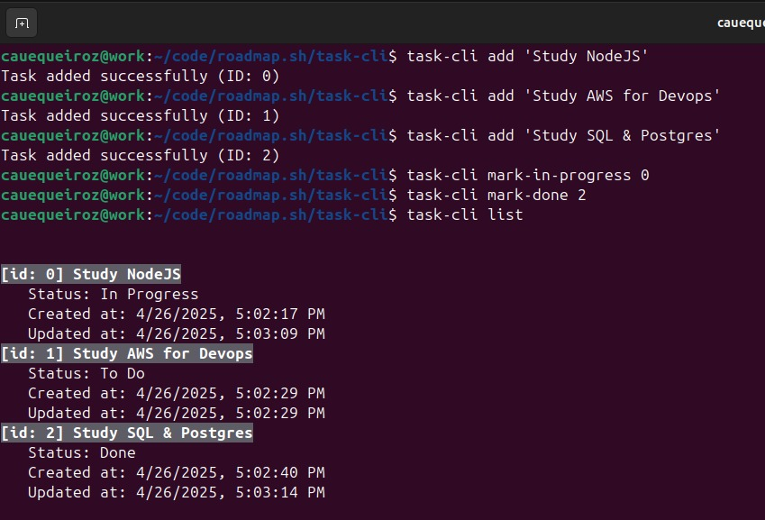

# Task Tracker CLI

Task Tracker built with NodeJS following the requirements from [Roadmap.sh Task Tracker](https://roadmap.sh/projects/task-tracker).

**Features:**
- Create, read, update and delete tasks
- Mark task as in-progress or done
- Filter tasks by status
- No libraries or frameworks
- Tasks are saved in a `db.json` file at the root folder



## Usage

Since no libraries or frameworks are being used, you just need to clone the project and link the package on your system.

```shell
$ git clone git@github.com:cauequeiroz/task-tracker-cli.git
$ cd task-tracker-cli
$ npm link
```

## CLI Reference

```shell
# Adding a new task
$ task-cli add "Buy groceries"

# Updating and deleting tasks
$ task-cli update 1 "Buy groceries and cook dinner"
$ task-cli delete 1

# Marking a task as in progress or done
$ task-cli mark-in-progress 1
$ task-cli mark-done 1

# Listing all tasks
$ task-cli list

# Listing tasks by status
$ task-cli list done
$ task-cli list todo
$ task-cli list in-progress
```